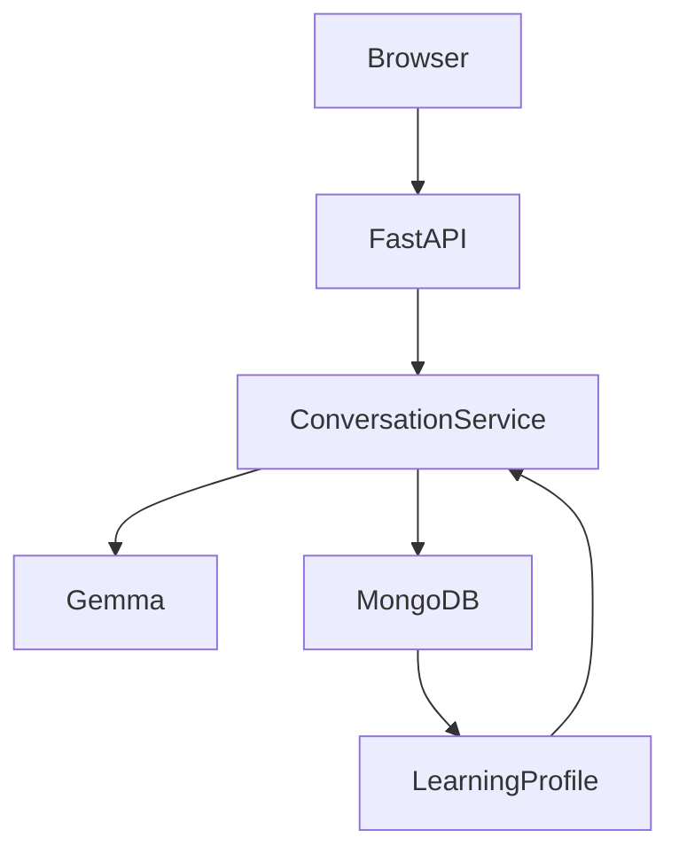

# English Practice Assistant — Codex Build Specification

## 1. Project Overview

Build a production-quality MVP called **English Practice Assistant**.

### Product tagline

> A personal English coach that remembers how you communicate.

### Core idea

The application is an AI-powered English practice partner designed for one specific type of learner: a software engineer who understands English reasonably well but struggles to express ideas naturally and confidently, especially in workplace situations.

This must **not** feel like a generic AI chatbot or generic English grammar checker.

The key product differentiator is **persistent learning memory**:

1. The user communicates with the assistant.
2. The AI responds naturally.
3. The AI identifies meaningful English issues.
4. The application stores recurring learning patterns.
5. Future practice uses those patterns to adapt the conversation.
6. The dashboard shows progress over time.

Example:

User:
> Yesterday I go to market and I buy some vegetables.

Assistant:
> A more natural version is: "Yesterday, I went to the market and bought some vegetables."

The application records a `past_tense` issue.

Later, if the user makes a similar mistake, the assistant can say:

> We've practiced this pattern before. Try the sentence again using the past tense.

The goal is to behave like a **coach with memory**, not a chatbot that starts from zero every conversation.

---

# 2. Primary User

Build the MVP around this persona:

### Software Engineer

The user:

- Understands technical English.
- Can read documentation and code.
- Can understand conversations reasonably well.
- Has difficulty expressing thoughts naturally.
- May make recurring grammar mistakes.
- May translate thoughts directly from their native language.
- Wants to communicate better in meetings, standups, code reviews, presentations, and everyday workplace conversations.

The application should prioritize **practical communication over academic grammar lessons**.

---

# 3. Product Goals

The MVP must achieve these goals:

1. Allow the user to practice English through conversation.
2. Correct meaningful mistakes without interrupting every sentence.
3. Explain corrections briefly.
4. Detect recurring mistakes.
5. Store learning history.
6. Adapt future practice based on stored weaknesses.
7. Provide workplace-specific practice.
8. Show simple progress metrics.
9. Demonstrate that the AI actually remembers previous interactions.
10. Keep the architecture simple enough to build and deploy quickly.

---

# 4. Non-Goals

Do NOT build these in the MVP:

- Native mobile applications.
- React/Next.js frontend.
- Separate frontend repository.
- Complex authentication/OAuth.
- Redis.
- Kafka.
- Celery.
- Kubernetes.
- Vector database.
- RAG pipeline.
- Fine-tuning.
- Voice synthesis.
- Speech recognition.
- Real-time audio streaming.
- Social networking.
- Public user profiles.
- Complex admin panel.
- Payment system.
- Subscription system.
- Gamification with points/badges.
- Complex analytics infrastructure.

The project should remain a small, understandable codebase.

---

# 5. Technology Stack

Use:

### Backend

- Python 3.11+
- FastAPI
- Pydantic v2
- Uvicorn

### Frontend

Use server-rendered HTML plus:

- HTML5
- CSS3
- Vanilla JavaScript

Do NOT use:

- React
- Next.js
- Vue
- Angular
- Tailwind
- Vite

The frontend should still look polished and modern.

### Database

- MongoDB
- Motor or the current recommended async MongoDB Python driver

The application must work with MongoDB Atlas.

### AI

Use **Gemma** as the core AI model.

Implement an AI-provider abstraction so the application does not become tightly coupled to one inference provider.

Example:

```python
class AIProvider:
    async def generate_response(...):
        ...

    async def evaluate_english(...):
        ...

    async def generate_practice(...):
        ...
```

The initial implementation should support a hosted Gemma inference provider through an environment-configured API endpoint/key.

Do NOT expose API keys to browser JavaScript.

Do NOT hard-code provider credentials.

---

# 6. Important AI Requirement

Gemma must be genuinely central to the application.

Do not create a normal chatbot and merely mention Gemma in the README.

Gemma should perform the core language intelligence:

- conversational response generation
- English evaluation
- correction suggestions
- mistake categorization
- practice recommendations
- adaptive conversation behavior

The application code should provide the memory and product logic around the model.

---

# 7. AI Provider Architecture

Create:

```text
app/services/ai/
├── base.py
└── gemma.py
```

`base.py` should define the provider interface.

Example:

```python
from abc import ABC, abstractmethod

class AIProvider(ABC):

    @abstractmethod
    async def generate_response(self, ...):
        pass

    @abstractmethod
    async def evaluate_english(self, ...):
        pass

    @abstractmethod
    async def generate_practice(self, ...):
        pass
```

`gemma.py` should implement the interface.

Use environment variables:

```env
AI_PROVIDER=gemma
GEMMA_API_URL=
GEMMA_API_KEY=
GEMMA_MODEL=
MONGODB_URI=
DATABASE_NAME=english_coach
SECRET_KEY=
```

Never commit secrets.

---

# 8. AI Output Must Be Structured

Whenever possible, ask Gemma for JSON output rather than relying on fragile free-form parsing.

Create Pydantic models such as:

```python
class Mistake(BaseModel):
    category: str
    original: str
    correction: str
    explanation: str
    severity: str
```

```python
class EnglishEvaluation(BaseModel):
    corrected_text: str
    mistakes: list[Mistake]
    strengths: list[str]
    scores: dict[str, int]
```

```python
class CoachResponse(BaseModel):
    response: str
    evaluation: EnglishEvaluation
    practice_suggestion: str | None = None
```

Validate AI output using Pydantic.

If AI returns invalid JSON, implement a safe retry/fallback mechanism.

---

# 9. AI Behavior

The assistant should follow these principles:

## 9.1 Do not over-correct

Do not identify every tiny stylistic difference as an error.

Focus on:

- recurring grammar mistakes
- incorrect tense
- incorrect articles
- incorrect prepositions
- sentence structure
- unnatural phrasing
- vocabulary problems
- workplace communication problems

## 9.2 Preserve the user's voice

Do not rewrite everything into extremely formal English.

Prefer:

> "I completed the task yesterday."

over:

> "I have successfully completed the aforementioned task in accordance with the prescribed timeline."

## 9.3 Explain briefly

Use:

1. What was wrong.
2. Natural correction.
3. Very short explanation.

## 9.4 Encourage the user

The assistant should not make the experience feel like an exam.

Use supportive language.

## 9.5 Adapt to history

If a mistake has appeared repeatedly, the assistant should use that information.

Example:

```text
You've made this tense mistake a few times before.
Try saying the sentence again using "went" instead of "go".
```

Do not mention internal database IDs or implementation details.

---

# 10. Learning Categories

Use these primary categories:

```text
grammar
vocabulary
natural_english
professional_english
sentence_structure
pronunciation
```

For the MVP, pronunciation can be reserved for future functionality because the application is text-based.

Useful mistake subtypes:

```text
past_tense
present_perfect
articles
prepositions
subject_verb_agreement
word_order
pluralization
verb_form
sentence_fragment
unnatural_phrase
word_choice
workplace_tone
```

The system should be extensible rather than hard-coded around only two mistakes.

---

# 11. User Learning Profile

Create a persistent learning profile.

Example:

```json
{
  "user_id": "friend-001",
  "skills": {
    "grammar": 72,
    "vocabulary": 68,
    "natural_english": 55,
    "professional_english": 61
  },
  "recurring_mistakes": [
    {
      "type": "past_tense",
      "frequency": 12,
      "last_seen": "2026-10-03T10:00:00Z"
    },
    {
      "type": "articles",
      "frequency": 7,
      "last_seen": "2026-10-02T10:00:00Z"
    }
  ],
  "strengths": [
    "technical vocabulary",
    "clear explanations"
  ]
}
```

Scores do not need to be scientifically accurate.

They are **product indicators**, not certified language proficiency scores.

Clearly label them as approximate progress indicators.

---

# 12. Database Design

Use MongoDB.

Collections:

```text
users
conversations
messages
learning_profiles
mistakes
```

A simpler implementation may embed messages inside conversations if that keeps the project smaller.

Prefer this structure:

## users

```json
{
  "_id": "...",
  "name": "Demo User",
  "created_at": "...",
  "updated_at": "..."
}
```

## conversations

```json
{
  "_id": "...",
  "user_id": "...",
  "mode": "free_conversation",
  "scenario": null,
  "created_at": "...",
  "updated_at": "..."
}
```

## messages

```json
{
  "_id": "...",
  "conversation_id": "...",
  "role": "user",
  "content": "...",
  "created_at": "..."
}
```

## mistakes

```json
{
  "_id": "...",
  "user_id": "...",
  "conversation_id": "...",
  "category": "past_tense",
  "original": "Yesterday I go...",
  "correction": "Yesterday I went...",
  "explanation": "Use the past tense for a completed action in the past.",
  "created_at": "..."
}
```

## learning_profiles

```json
{
  "_id": "...",
  "user_id": "...",
  "skills": {
    "grammar": 72,
    "vocabulary": 68,
    "natural_english": 55,
    "professional_english": 61
  },
  "recurring_mistakes": [],
  "strengths": [],
  "updated_at": "..."
}
```

Create useful indexes:

```text
messages.conversation_id
conversations.user_id
mistakes.user_id
learning_profiles.user_id
```

---

# 13. Application Flow

## First visit

Show a polished landing/dashboard screen.

Include:

- product name
- tagline
- short explanation
- Start Practice button
- current learning summary
- practice modes

For the MVP, avoid requiring account registration.

Use a generated or configured demo user ID.

---

# 14. Main Navigation

Use a simple navigation structure:

```text
Home
Practice
Progress
```

Optional:

```text
Settings
```

Keep navigation lightweight.

---

# 15. Practice Modes

Implement three modes.

## Mode 1 — Free Conversation

The user can talk/write about anything.

Example:

> "Tell me about something interesting that happened today."

The assistant responds naturally.

After the user's response, the system evaluates the English.

---

## Mode 2 — Targeted Practice

Allow selecting:

```text
Grammar
Natural English
Vocabulary
Professional English
Recurring Mistakes
```

If the user selects `Recurring Mistakes`, use the user's stored mistakes to generate practice.

Example:

If:

```text
past_tense = 12
articles = 7
```

then generate a scenario requiring past-tense responses.

---

## Mode 3 — Workplace English

Include scenarios:

```text
Daily Standup
Explain a Bug
Code Review
Ask for Help
Manager Update
Client Meeting
Technical Presentation
Disagree Professionally
Give a Project Status Update
```

Each scenario should provide a realistic prompt.

Example:

### Daily Standup

> Your manager asks what you worked on yesterday, what you're doing today, and whether you have any blockers.

The user responds.

The AI evaluates:

- clarity
- grammar
- naturalness
- professional tone

---

# 16. Strong Demonstration Scenario

The demo should clearly demonstrate memory.

Create a flow such as:

### Session 1

User:

> Yesterday I go to market and buy vegetables.

AI identifies:

```text
past_tense
```

Store it.

### Session 2

User makes another past-tense mistake.

The application recognizes the recurring issue.

UI:

> **Recurring pattern detected**
>
> You've been practicing past tense. Try this sentence again.

Then generate targeted practice.

### Progress

Dashboard shows:

```text
Past tense
12 occurrences → 7 occurrences
```

If actual historical data is unavailable, don't fabricate a false improvement metric.

For a demo account, seeded/demo data may be used, but it must be clearly labeled as demo data.

---

# 17. Conversation UI

Create a modern chat interface.

Requirements:

- User messages on one side.
- Assistant messages on the other.
- Clear typography.
- Smooth message appearance.
- Loading indicator.
- Disable send button while waiting.
- Enter to send.
- Shift+Enter for newline.
- Mobile responsive.
- Auto-scroll.
- Friendly empty state.

After a user message, show an expandable feedback section.

Example:

```text
Your message

"I have went to office yesterday."

────────────────────

Coach feedback

Better:
"I went to the office yesterday."

Why:
Use "went" for a completed action in the past.

Pattern:
Past tense
```

Don't make the feedback visually overwhelming.

---

# 18. Progress Dashboard

Create a polished progress page.

Show:

### Skill cards

```text
Grammar
72%

Vocabulary
68%

Natural English
55%

Professional English
61%
```

### Recurring mistakes

Example:

```text
Past tense        ████████████
Articles          ███████
Prepositions      █████
Word order        ███
```

### Strengths

Example:

```text
✓ Strong technical vocabulary
✓ Good ability to explain technical concepts
✓ Clear sentence intent
```

### Recent practice

Show recent sessions:

```text
Daily Standup
Today

Code Review
Yesterday

Free Conversation
2 days ago
```

Do not claim statistically meaningful proficiency.

Use labels such as:

> Personal learning indicators

---

# 19. Adaptive Prompt Construction

Before sending a conversation request to Gemma, construct context containing:

1. System instructions.
2. Current conversation.
3. User learning profile.
4. Relevant recurring mistakes.
5. Current practice mode.
6. Current scenario.

Example conceptual prompt:

```text
You are an English communication coach.

The learner is a software engineer.

Your goals:
- Keep the conversation natural.
- Help the learner express ideas clearly.
- Correct important English mistakes.
- Focus on recurring weaknesses.
- Do not over-correct.
- Encourage the learner.
- Prefer practical workplace English.

Known recurring weaknesses:
- past tense
- articles

Current practice:
Daily standup

Return structured JSON.
```

Do not blindly include the entire user's historical conversation.

Only provide relevant learning information and recent conversation context.

---

# 20. Privacy and API Key Security

This is important.

Never expose:

```text
GEMMA_API_KEY
MONGODB_URI
SECRET_KEY
```

to the browser.

All AI calls must go:

```text
Browser
   ↓
FastAPI
   ↓
Gemma provider
```

not:

```text
Browser
   ↓
Gemma API
```

If implementing BYOK:

- User enters the Gemma API key into a secure UI.
- Send it to FastAPI over HTTPS.
- Never store it in MongoDB.
- Never log it.
- Never return it to the browser.
- Keep it only for the shortest practical session.
- Clear it when the session ends.

Provide an optional:

```text
Use your own Gemma API key
```

configuration.

Do not require BYOK for the primary demo unless absolutely necessary.

---

# 21. Demo Mode

The application should have a usable demo experience.

A reviewer should be able to understand the product quickly.

Provide:

```text
Try Demo
```

The demo should have either:

1. A working configured Gemma provider, or
2. A clearly labeled demo mode with pre-seeded conversation examples.

Do not pretend a precomputed response is live AI.

If no Gemma credentials are configured:

```text
AI provider unavailable.

You can configure GEMMA_API_URL and GEMMA_API_KEY
to enable live AI conversations.
```

The application should still start successfully.

---

# 22. Error Handling

The application must gracefully handle:

- Gemma API timeout.
- Gemma API failure.
- Invalid AI JSON.
- MongoDB unavailable.
- Empty user message.
- Extremely long input.
- Missing environment variables.
- Rate-limit errors.

Never display stack traces to users.

Return friendly errors.

Example:

> The coach is temporarily unavailable. Please try again in a moment.

Log useful server-side diagnostic information without logging secrets.

---

# 23. Input Limits

Protect the application from abuse.

Implement reasonable limits such as:

```text
Maximum message length: 2,000 characters
Maximum conversation context: configurable
```

Reject empty messages.

Trim unnecessary whitespace.

---

# 24. API Routes

Use REST-style FastAPI endpoints.

Suggested routes:

```text
GET  /
GET  /api/health

POST /api/conversations
GET  /api/conversations/{conversation_id}

POST /api/conversations/{conversation_id}/messages

GET  /api/progress
GET  /api/mistakes
GET  /api/practice/modes

POST /api/practice/start
```

Exact route structure may be adjusted if a cleaner implementation is found.

Keep routes thin.

Business logic belongs in services.

---

# 25. Suggested Backend Structure

Use:

```text
app/
├── main.py
│
├── routes/
│   ├── pages.py
│   ├── sessions.py
│   ├── practice.py
│   └── dashboard.py
│
├── services/
│   ├── conversation.py
│   ├── evaluation.py
│   ├── memory.py
│   └── ai/
│       ├── base.py
│       └── gemma.py
│
├── models/
│   ├── user.py
│   ├── conversation.py
│   └── feedback.py
│
├── db/
│   └── mongodb.py
│
└── config.py

templates/
└── index.html

static/
├── style.css
└── app.js

tests/
├── test_health.py
├── test_evaluation.py
├── test_memory.py
└── test_routes.py
```

Do not create files unnecessarily.

---

# 26. Configuration

Use Pydantic Settings.

Example:

```python
class Settings(BaseSettings):
    mongodb_uri: str
    database_name: str = "english_coach"

    ai_provider: str = "gemma"
    gemma_api_url: str | None = None
    gemma_api_key: str | None = None
    gemma_model: str | None = None

    secret_key: str
```

Use `.env` locally.

Provide:

```text
.env.example
```

Never commit `.env`.

---

# 27. Frontend Design

The frontend should feel like a modern AI product.

Visual direction:

- clean
- premium
- calm
- focused
- professional
- not childish
- not like a traditional grammar-learning website

Use:

- CSS gradients where appropriate
- subtle shadows
- rounded cards
- good spacing
- modern typography
- smooth hover states
- small animations
- progress indicators
- responsive layout

Avoid excessive animation.

The interface should prioritize readability.

---

# 28. Landing Page

Hero:

```text
English Practice Assistant

Practice English.
Build confidence.
Remember what you're learning.
```

Supporting text:

> An AI communication coach that remembers your recurring mistakes and adapts your practice over time.

CTA:

```text
Start Practicing
```

Secondary CTA:

```text
See How It Works
```

Show three feature cards:

```text
Conversation
Practice through realistic conversations.

Memory
Your recurring mistakes become part of your learning profile.

Workplace English
Practice standups, meetings, code reviews, presentations, and more.
```

---

# 29. UX Details

When AI is generating:

```text
Coach is thinking...
```

After response:

Show assistant message first.

Then feedback.

The user should not be forced to read a long grammar lesson.

Keep feedback concise.

---

# 30. Accessibility

Implement:

- semantic HTML
- keyboard navigation
- visible focus states
- sufficient contrast
- labels for form controls
- aria labels where necessary
- responsive design

---

# 31. Security

Implement:

- environment variables for secrets
- input validation
- message length limits
- no API keys in frontend
- no secret logging
- safe MongoDB queries
- no arbitrary code execution
- safe error responses

Add basic security headers if practical.

---

# 32. Testing

Write tests for the most important behavior.

Minimum:

### Health

```text
GET /api/health
```

returns success.

### Validation

Empty messages are rejected.

### AI parsing

Valid structured AI responses parse successfully.

Invalid AI responses trigger fallback/error handling.

### Memory

A detected mistake is stored.

Repeated mistakes increase frequency.

Learning profile retrieves recurring mistakes.

### API

Conversation creation works.

Message submission works with a mocked AI provider.

Progress endpoint returns expected structure.

Use mocked AI responses in tests.

Tests must not require a live Gemma API key.

---

# 33. AI Provider Mock

Create a fake provider for tests:

```python
class MockAIProvider(AIProvider):
    async def generate_response(self, ...):
        ...

    async def evaluate_english(self, ...):
        ...

    async def generate_practice(self, ...):
        ...
```

This makes testing deterministic.

---

# 34. Seed / Demo Data

Provide a script or endpoint for development/demo data.

Example:

```text
scripts/seed_demo.py
```

Seed:

- one demo user
- several conversations
- recurring mistakes
- learning profile
- recent practice history

Clearly label demo information in the UI.

Do not mix fake demo statistics with a real user's statistics.

---

# 35. Deployment

The primary target is:

```text
Render
```

for the FastAPI application.

MongoDB:

```text
MongoDB Atlas
```

AI:

```text
Hosted Gemma inference
```

or configurable external Gemma inference.

The project must also be runnable locally.

---

# 36. Render Requirements

Provide:

```text
render.yaml
```

if useful.

The server must bind to:

```text
0.0.0.0
```

and use the platform-provided `PORT`.

Example command:

```text
uvicorn app.main:app --host 0.0.0.0 --port $PORT
```

Do not assume local port `8000` in production.

---

# 37. Docker

A Dockerfile is optional but recommended.

If included:

- use a small Python base image
- install requirements
- copy application
- expose the application port
- start Uvicorn

Do not include model weights in the container.

The Render deployment is for the web application, not local Gemma model inference.

---

# 38. README

Create a high-quality README.

Sections:

```text
# English Practice Assistant

## Why I Built This

## The Problem

## The Idea

## Features

## How It Works

## Architecture

## Tech Stack

## Gemma Integration

## Learning Memory

## Running Locally

## Environment Variables

## MongoDB Setup

## Deployment

## Project Structure

## Testing

## Open Innovation

## Future Improvements
```

Include an architecture diagram using Mermaid if appropriate.

Example:



---

# 39. Open Innovation Section

The README must explain why open innovation matters.

Do not claim that closed APIs cannot implement memory or personalization.

Explain that the project benefits from:

- model choice
- provider independence
- deployment flexibility
- experimentation
- potential privacy/control
- ability to move inference between hosted and self-managed infrastructure

Use wording similar to:

> English practice is personal. The assistant needs to understand not only what a learner is saying, but also the patterns in how they communicate over time.
>
> We chose Gemma because an open-weight model gives us more control over the AI layer. The application can experiment with different Gemma models and inference environments without redesigning the learning system around one proprietary API.
>
> This is particularly useful for a product that builds a personal learning profile. If privacy, cost, or deployment requirements change, the AI layer can move from hosted inference to infrastructure we control while the rest of the application remains largely unchanged.
>
> For this project, open innovation is not simply about using a free model. It gives us flexibility to experiment, control how the AI is deployed, and build a learning experience that can evolve with the learner.

Adapt the wording to the actual implementation.

Do not make unsupported claims.

---

# 40. Developer Article / Hackathon Story

The repository should contain enough information to make it easy to write the DEV article.

The story should focus on:

1. A real friend/person.
2. Their actual communication problem.
3. Why generic English apps weren't enough.
4. Why persistent memory matters.
5. How Gemma powers the AI.
6. What was built during the challenge.
7. A concrete example of adaptation.
8. Technical architecture.
9. What open innovation enabled.
10. What was learned.

Avoid turning the article into a generic AI tutorial.

---

# 41. Hackathon Demo Flow

Optimize the application for a 2–3 minute demonstration.

Recommended flow:

### Step 1

Open dashboard.

Show:

```text
Recurring weakness:
Past tense
```

### Step 2

Start:

```text
Workplace → Daily Standup
```

### Step 3

Answer the scenario with an intentional mistake.

### Step 4

Gemma responds and provides correction.

### Step 5

Show:

```text
Pattern detected
Past tense
```

### Step 6

Start another targeted practice.

### Step 7

Show progress/memory.

The reviewer should immediately understand:

> "This assistant remembers how this person communicates."

---

# 42. Performance

Do not over-engineer.

Optimize for:

- fast page load
- minimal JavaScript
- async API requests
- asynchronous MongoDB access
- reasonable AI prompt sizes

Do not implement streaming unless it is trivial and reliable.

---

# 43. Logging

Use Python logging.

Log:

- request failures
- AI provider failures
- database errors
- validation failures
- useful timing information

Never log:

- API keys
- MongoDB credentials
- passwords
- sensitive user content unnecessarily

---

# 44. Code Quality

Codex should produce:

- type hints
- Pydantic validation
- clean service boundaries
- small functions
- meaningful names
- comments only where useful
- no giant files where avoidable
- no duplicated business logic
- no dead code

Follow standard Python formatting.

Prefer straightforward code over clever abstractions.

---

# 45. Definition of Done

The project is complete only when all of the following are true:

## Functional

- [ ] FastAPI application starts.
- [ ] Landing page works.
- [ ] User can start a conversation.
- [ ] User can send messages.
- [ ] Gemma generates responses.
- [ ] English feedback is generated.
- [ ] Mistakes are stored.
- [ ] Recurring mistakes are detected.
- [ ] Future practice uses recurring mistakes.
- [ ] Workplace scenarios work.
- [ ] Progress dashboard works.
- [ ] MongoDB persistence works.
- [ ] Demo mode works without crashing if AI credentials are missing.

## Technical

- [ ] AI provider abstraction exists.
- [ ] Gemma provider exists.
- [ ] Mock AI provider exists.
- [ ] Pydantic models validate AI output.
- [ ] Environment variables are used.
- [ ] Secrets are not exposed to frontend.
- [ ] Tests exist.
- [ ] README exists.
- [ ] `.env.example` exists.
- [ ] `.gitignore` exists.
- [ ] Render deployment configuration exists or deployment instructions are complete.

## UX

- [ ] Responsive UI.
- [ ] Loading states.
- [ ] Error states.
- [ ] Empty states.
- [ ] Accessible forms.
- [ ] Modern visual design.
- [ ] Feedback is concise.
- [ ] Demo story is easy to understand.

---

# 46. Implementation Order

Codex should implement in this order:

## Phase 1 — Foundation

1. Create project structure.
2. Configure FastAPI.
3. Configure Pydantic Settings.
4. Configure MongoDB.
5. Create health endpoint.
6. Create base HTML page.

## Phase 2 — AI

7. Create AIProvider interface.
8. Implement Gemma provider.
9. Create structured AI response models.
10. Implement AI parsing and error handling.
11. Implement mock provider.

## Phase 3 — Conversation

12. Create conversations.
13. Create messages.
14. Build conversation service.
15. Connect conversation UI.
16. Add loading/error states.

## Phase 4 — Learning Memory

17. Implement mistake extraction.
18. Persist mistakes.
19. Build learning profile.
20. Calculate simple progress indicators.
21. Retrieve recurring mistakes.

## Phase 5 — Adaptive Practice

22. Add targeted practice.
23. Add workplace scenarios.
24. Inject recurring mistakes into prompts.
25. Add targeted recurring-mistake practice.

## Phase 6 — Dashboard

26. Build progress page.
27. Show skills.
28. Show recurring mistakes.
29. Show recent sessions.
30. Show strengths.

## Phase 7 — Polish

31. Improve visual design.
32. Add animations.
33. Improve responsive behavior.
34. Improve accessibility.
35. Improve empty/loading/error states.

## Phase 8 — Testing

36. Add unit tests.
37. Add API tests.
38. Test mocked AI.
39. Test memory behavior.
40. Test missing AI configuration.

## Phase 9 — Deployment

41. Add Render configuration.
42. Add production startup command.
43. Document MongoDB Atlas setup.
44. Document Gemma configuration.
45. Test production deployment.

## Phase 10 — Documentation

46. Finish README.
47. Add architecture diagram.
48. Explain open innovation.
49. Add screenshots/demo instructions.
50. Add future roadmap.

---

# 47. Important Implementation Constraint

Do not stop after creating a skeleton.

The final repository must be a **working MVP**, not just a collection of placeholder files.

Avoid TODOs for core functionality.

If an external Gemma API cannot be configured automatically, implement the provider interface and a clear configuration mechanism rather than replacing Gemma with another model.

Do not silently substitute OpenAI, Claude, or another proprietary model for Gemma.

---

# 48. Graceful AI Configuration Strategy

The application should support these states:

### State A — Live Gemma

```text
GEMMA_API_URL configured
GEMMA_API_KEY configured
```

Use real Gemma inference.

### State B — Demo

No Gemma credentials.

Application still loads.

User can explore seeded demo conversations and learning history.

Clearly display:

```text
Demo data
```

### State C — Invalid Gemma configuration

Show:

```text
Live AI is not configured correctly.
Please check the Gemma provider settings.
```

Do not crash the entire application.

---

# 49. Future Roadmap

Document, but do not implement:

```text
Voice conversations
Speech recognition
Pronunciation analysis
Personalized curriculum
Local Gemma inference
Mobile app
Teacher dashboard
Multiple learners
More advanced analytics
CEFR-style assessment
Browser extension
Slack/Teams workplace practice
```

---

# 50. Final Product Principle

Every major feature should reinforce this idea:

> **The assistant should remember how the learner communicates and use that memory to help them improve.**

If a proposed feature does not contribute to that goal, do not add it to the MVP.

The project should feel like:

```text
Chatbot
   ↓
AI Coach
   ↓
AI Coach + Memory
   ↓
Personalized English Coach
```

The final experience should make the reviewer think:

> "This isn't just an AI chatbot correcting English. It actually learns what this person struggles with and changes how it coaches them."

---

# 51. Codex Execution Instructions

You are the primary implementation agent.

Read this entire specification before modifying the repository.

Then:

1. Inspect the existing repository.
2. Preserve useful existing infrastructure if compatible.
3. Rename/restructure the project around English Practice Assistant where appropriate.
4. Implement the MVP completely.
5. Do not ask for confirmation for ordinary implementation decisions.
6. Choose the simplest reasonable implementation when the specification leaves a minor detail open.
7. Do not introduce unnecessary dependencies.
8. Run tests after implementation.
9. Run the application locally if possible.
10. Fix errors discovered during testing.
11. Review the UI manually through the available browser/testing tooling if available.
12. Verify that no secrets are committed.
13. Verify that the application works without a configured Gemma key in demo mode.
14. Verify that live Gemma integration is isolated behind the AI provider interface.
15. Update README with exact setup instructions.
16. At the end, provide a concise implementation summary containing:
    - files created/changed
    - features implemented
    - tests run
    - commands to run locally
    - required environment variables
    - deployment instructions
    - any known limitations

Do not merely describe how the project could be built.

**Build it.**
