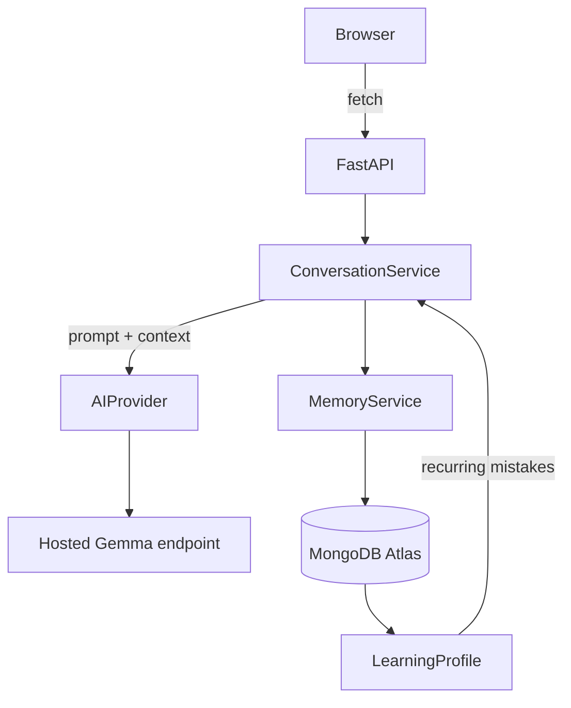

# English Practice Assistant

> A personal English coach that remembers how you communicate.

An AI-powered practice partner who understand English well but struggle to express ideas naturally at work. Gemma does the language intelligence; the app adds persistent memory of the learner's recurring mistakes and uses it to adapt every future session.

## Why I Built This

A friend of mine reads documentation and code easily and follows meetings, but freezes when they have to explain a bug or give a standup update. They translate directly from their first language, and the same mistakes keep coming back.

## The Problem

Generic chatbots correct a sentence and forget it. Grammar apps teach rules the learner already roughly knows. Neither notices that "past tense" has been wrong twelve times this month, and neither practices the learner's real situations: standups, code reviews, client meetings.

## The Idea

Chatbot → AI coach → AI coach **with memory** → personalised English coach.

1. The learner writes the coach replies naturally.
2. Gemma evaluates the message and returns structured mistakes.
3. The app stores each mistake and counts recurring patterns.
4. The next prompts tell Gemma which weaknesses to focus on.
5. The Progress page shows what recurs and, when real earlier data exists, how it changes.

## Features

- **Free conversation**, **targeted practice** (grammar, natural English, vocabulary, professional English, *recurring mistakes*) and **9 workplace scenarios** (standup, explain a bug, code review, ask for help, manager update, client meeting, technical presentation, disagree professionally, project status).
- Concise, collapsible feedback: natural version, short why, pattern name. No over-correcting.
- "Recurring pattern detected" notices once a mistake type has appeared twice or more.
- Progress page: skill indicators, recurring-mistake bars, strengths, recent sessions.
- Only real data: progress is computed from your own sessions. With no data it says so; with little data it still shows results plus a "limited data" notice (reliable after about 5 evaluated messages).
- Optional bring-your-own Gemma key (server memory only).
- Works without AI credentials (browse); chat explains how to enable live AI.

## How It Works

Each message triggers two Gemma calls in parallel: a conversational reply and a structured evaluation (JSON validated with Pydantic, one automatic repair retry, graceful fallback to "feedback unavailable"). The prompt contains the persona, current mode/scenario, the learner's top recurring weaknesses and the last few messages; never the whole history or any database IDs.

## Architecture



The browser never talks to Gemma or MongoDB; keys stay on the server.

## Tech Stack

Python 3.11+, FastAPI, Pydantic v2 + pydantic-settings, async PyMongo (`AsyncMongoClient`), httpx, Jinja2, vanilla HTML/CSS/JS. No frontend framework.

## Gemma Integration

`app/services/ai/base.py` defines `AIProvider` (`generate_response`, `evaluate_english`, `generate_practice`). `gemma.py` implements it against an **OpenAI-compatible chat-completions endpoint** serving a Gemma model (e.g. vLLM, Ollama, or any hosted Gemma API exposing `/v1/chat/completions`). Because Gemma chat templates reject a separate system role and require alternating turns, instructions are folded into the first user turn. `mock.py` is a deterministic provider used by the tests. There is no fallback to any other model.

## Learning Memory

- `mistakes`: every detected mistake (category, original, correction, explanation).
- `learning_profiles`: recurring mistake counts, skill indicators (a smoothed average of Gemma's 0-100 scores, absent until measured) and strengths.
- A type with frequency ≥ 2 is "recurring": it is injected into prompts, triggers the pattern notice, and drives *Recurring Mistakes* practice.
- Week-over-week change is shown only when earlier real data exists. Scores are **approximate personal indicators**, not proficiency levels.

## Running Locally

```bash
python -m venv .venv && source .venv/bin/activate   # Windows: .venv\Scripts\activate
pip install -r requirements.txt
cp .env.example .env        # fill in values
uvicorn app.main:app --reload
```

Open http://127.0.0.1:8000.

## Environment Variables

| Variable | Purpose |
| --- | --- |
| `AI_PROVIDER` | `gemma` (only provider implemented) |
| `GEMMA_API_URL` | Full chat-completions URL of your Gemma endpoint |
| `GEMMA_API_KEY` | Bearer key for that endpoint (server-side only) |
| `GEMMA_MODEL` | Model name sent to the endpoint |
| `MONGODB_URI` | MongoDB / Atlas connection string |
| `DATABASE_NAME` | Defaults to `english_coach` |
| `SECRET_KEY` | Signs the anonymous learner cookie; set a long random value in production |
| `MAX_CONTEXT_MESSAGES` | Recent messages sent to the model (default 8) |

States: **live** (URL + key set), **unconfigured** (neither set: app loads and can be browsed), **invalid** (partial/incorrect settings: friendly error, no crash).

## MongoDB Setup

Create a free Atlas cluster, add a database user, allow your IP (or Render's egress), and put the connection string in `MONGODB_URI`. Collections and indexes (`messages.conversation_id`, `conversations.user_id`, `mistakes.user_id`, unique `learning_profiles.user_id`) are created automatically on startup.

## Deployment

Render: push the repo, create a Blueprint from `render.yaml` (or a Web Service with build `pip install -r requirements.txt` and start `uvicorn app.main:app --host 0.0.0.0 --port $PORT`), then set `MONGODB_URI`, `GEMMA_API_URL`, `GEMMA_API_KEY`, `GEMMA_MODEL`. `SECRET_KEY` is generated. Health check: `/api/health`. A `Dockerfile` is included; no model weights are bundled.

## Project Structure

```
app/            main.py, config.py, db/, models/, routes/, services/ (conversation, evaluation, memory, ai/)
templates/      index.html
static/         style.css, app.js
tests/          health, evaluation/parsing, memory, routes (mock AI + in-memory DB)
```

## Testing

```bash
pytest
```

Tests need no Gemma key and no MongoDB: they use `MockAIProvider` and an in-memory database fake.

## Open Innovation

English practice is personal. The assistant needs to understand not only what a learner is saying, but also the patterns in how they communicate over time.

We chose Gemma because an open-weight model gives more control over the AI layer. The AI sits behind a small provider interface, so different Gemma models and inference environments can be tried without redesigning the learning system. That matters for a product that builds a personal learning profile: if privacy, cost or deployment needs change, inference can move from hosted to self-managed infrastructure while the memory and product logic stay largely unchanged. (Today's implementation talks to any OpenAI-compatible Gemma endpoint; local inference is on the roadmap, not built.) Closed APIs could implement the same memory; the benefit here is choice and control, not capability.

## Future Improvements

Voice conversations, speech recognition, pronunciation analysis, personalised curriculum, local Gemma inference, mobile app, teacher dashboard, multiple learners, richer analytics, CEFR-style assessment, browser extension, Slack/Teams practice.

## Known Limitations

- Identity is an anonymous signed cookie; there are no accounts.
- Gemma's output quality depends on the model served; JSON compliance is validated and retried once.
